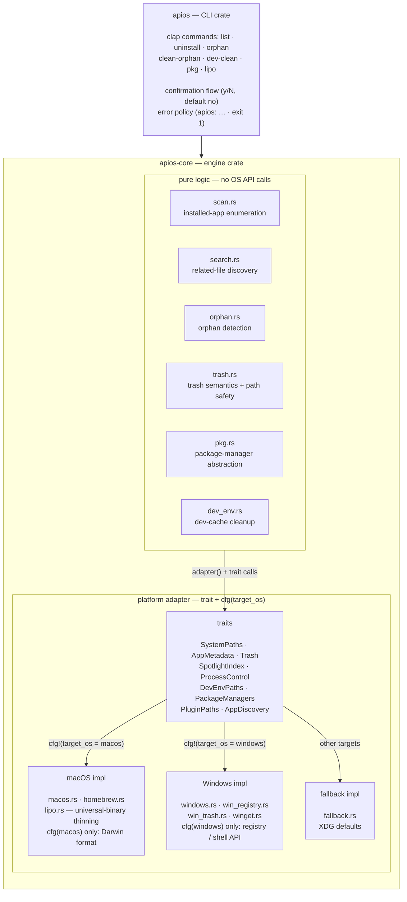

[English](ARCHITECTURE.md) | [中文](zh-CN/ARCHITECTURE.zh-CN.md)

# Architecture

ApiosCleaner is a cross-platform app cleaner built around a **portable Rust
core** and a thin **platform adapter layer**. All matching, scanning, and
orphan-detection logic lives in the core with no OS API dependency; every
platform-specific behavior sits behind a trait implemented per-OS and
dispatched at compile time.

## Crates

| Crate | Role |
|---|---|
| `apios-core` | The engine: file discovery, name matching, orphan detection, trash semantics, package-manager abstraction. Cross-platform (type-checks on Linux/Windows with zero changes); macOS-only modules (universal-binary thinning) live in the platform layer behind `cfg(target_os)` gates. |
| `apios` | The CLI. Arg parsing (clap), confirmation flow, error formatting (`apios: …` + exit 1), reporting. Depends only on `apios-core`. |

## Platform adapter pattern

Every OS-dependent behavior is a trait in `apios-core/src/platform/`:

| Trait | Responsibility | macOS impl | Windows impl | Fallback impl |
|---|---|---|---|---|
| `SystemPaths` | home, caches, temp, app folders | real paths | `USERPROFILE` / `%APPDATA%` / `%LOCALAPPDATA%` family | XDG defaults |
| `AppMetadata` | entitlements, team identifier | codesign | `None` (registry holds the metadata) | `None` |
| `Trash` | trash dir + `move_to_trash` action | `~/.Trash`, archive move | `SHFileOperationW` (`FO_DELETE` + `FOF_ALLOWUNDO` → Recycle Bin) | XDG trash dir |
| `SpotlightIndex` | supplemental file lookup | `mdfind` (with timeout) | empty | empty |
| `ProcessControl` | terminate a running app | `ps` + `kill -TERM` (bundle-prefix scoped) | `tasklist` + `taskkill /F /T /IM` | no-op |
| `DevEnvPaths` | dev-environment cache tables | macOS table | `%LOCALAPPDATA%`/`%APPDATA%` table (13 envs) | Linux XDG table |
| `PackageManagers` | per-manager uninstall/autoremove | Homebrew | winget | none yet |
| `PluginPaths` | plugin category table | 18 macOS categories | empty | empty |
| `AppDiscovery` | installed-app enumeration | `.app` walk (scan.rs) | registry uninstall entries + Start Menu `.lnk` | `.app` walk (scan.rs) |

`platform/mod.rs` exposes a `pub type Adapter` chosen by `cfg(target_os)`
(`macos::MacOsAdapter` on macOS, `windows::WindowsAdapter` on Windows,
`fallback::FallbackAdapter` elsewhere), and a global `adapter()` accessor.
Engine code calls `crate::platform::adapter()` with the trait in scope — the
logic never branches on the OS itself, so a new platform only needs new trait
implementations, not changes to the engine.

The macOS implementation is further split:
- `platform/macos.rs` — paths, Spotlight (`mdfind`), process control
  (`ps`/`kill`), `getconf`
- `platform/homebrew.rs` — the brew CLI wrapper (dependent checks, `--zap`,
  error triage)

The Windows implementation is hand-written FFI only (zero third-party deps):
- `platform/windows.rs` — `WindowsAdapter` (paths, discovery, trash, taskkill,
  dev-env table)
- `platform/win_registry.rs` — `Reg*W` enumeration of HKLM/HKCU uninstall
  entries (pure parser separated from the FFI shell)
- `platform/win_trash.rs` — `SHFileOperationW` Recycle Bin calls (batch +
  per-file failure classification)
- `platform/winget.rs` — the winget CLI wrapper (all packages map to
  `Formula`; no dependents/autoremove concept)

The Windows orphan search derives its needles from the executable paths
themselves — up to 3 ancestor directory names + the file stem of every
discovered app (`Tencent\Weixin\Weixin.exe` → `weixin` + `tencent`), threshold
≥3 chars — instead of relying on display names, which never match vendor
directory names ("7-Zip 24.09 (x64)" vs "7-Zip"). Structural directory names
(a 21-entry table: programs/startmenu/programfiles roots, local/roaming/appdata,
bin/program, microsoft/windows, …) never become needles, and result entries
whose names match a 15-entry AppData system list, `windows*` prefixes, or known
shared dirs (`common files`, `msbuild`, `reference assemblies`, `wsl`, …) are
filtered out — `validate_path` only guards critical *roots*, so this filter is
what keeps `clean-orphan` away from system components.

## Engine modules

| Module | Purpose |
|---|---|
| `scan.rs` | Enumerate installed apps (bundle-identifier reading, symlink-safe dedup, `com.alienator88.Pearcleaner` self-exclusion; macOS/fallback discovery delegates here) |
| `search.rs` | Find all related files of an app: directory walk with depth rules, vendor-directory fallback, name matching, outliers, final set dedup |
| `matcher.rs` / `conditions.rs` | Should-skip rules and per-app specific conditions (bundle-id exact matching, include/exclude force lists) |
| `orphan.rs` | Detect files left behind by uninstalled apps (macOS: prebuilt UUID→bundle-id map; Windows: path-derived needles + system-dir filtering — see above) |
| `identifiers.rs` | Cached bundle-identifier extraction + normalized-name helpers |
| `trash.rs` | Move-to-Trash archive semantics + critical-path validation + undo (restore) |
| `pkg.rs` | Package-manager abstraction and categorization |
| `dev_env.rs` | Dev-environment cache size/cleanup |
| `model.rs` | Core types: `AppInfo`, `Condition`, `Sensitivity`, `SkipCondition` |

## Safety model

Three layers protect against destructive mistakes:

1. **Path validation** (`trash.rs::validate_path`): every path is lexically
   normalized (`..` folded, duplicate slashes collapsed, trailing slashes
   stripped, relative paths rejected) **before** matching against a critical
   list (`/Applications`, `/Library`, `/System`, `/usr`, `/bin`, `/sbin`,
   `/etc`, `/var`, `/private`, `/opt`, `/Users`, `/Users/Shared`, home,
   `~/Applications`). Sub-paths under those roots (e.g. `~/Library/Preferences/…`)
   remain legal delete targets.
   On Windows the drive prefix is **preserved** during normalization (a
   `C:\Windows` that collapsed to `/Windows` would bypass the POSIX table —
   fixed), and the critical list is env-driven: `SystemRoot`, `ProgramFiles`,
   `ProgramFiles(x86)`, `ProgramData`, the profile root, plus a format check
   that blocks any bare drive root (`X:\`).
2. **Reversible deletion**: files are *moved* into a timestamped archive
   folder inside the Trash (`<Name>_<yyyy-MM-dd_HH-mm-ss>`), never removed.
   `restore_files` moves them back. On Windows the same guarantee comes from
   the OS: `SHFileOperationW` with `FOF_ALLOWUNDO` sends files to the Recycle
   Bin (no archive folder, so restore is up to the user via the system UI).
3. **Confirmation**: every destructive command prints what it will do and asks
   `y/N` (default no). `-y` skips the prompt for scripting; a rejection aborts
   with `Aborted — nothing was deleted.` and exit 0.

## Testing strategy

- **Unit tests in-module** cover the pure logic with fixture bytes/strings and
  `tempfile` temp trees — no live system state needed.
- **Linux + Windows cross-check** (`cargo check --target
  x86_64-unknown-linux-gnu` and `--target x86_64-pc-windows-gnu` in CI) keeps
  the core truly portable: anything that only compiles on macOS is confined to
  the adapter layer.
- **Windows native job** runs the full suite plus Windows-only integration
  tests on `windows-latest`: a temporary HKCU uninstall key is created,
  enumerated, and deleted; a temp file is moved to the Recycle Bin via
  `SHFileOperationW`; `winget list` output is parsed from fixtures.
- **Live regression** on macOS compares output against the reference
  implementation (9/9 and 17/17 identical file sets on test apps).
