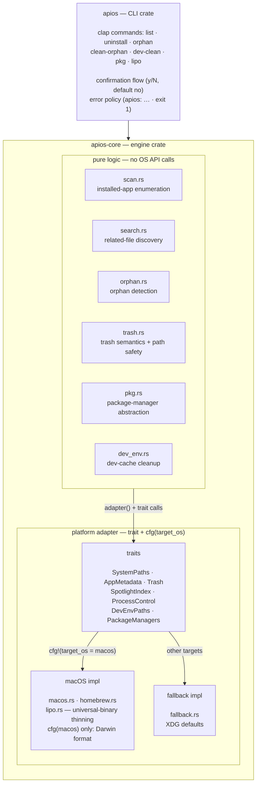

# Architecture

ApiosCleaner is a cross-platform app cleaner built around a **portable Rust
core** and a thin **platform adapter layer**. All matching, scanning, and
orphan-detection logic lives in the core with no OS API dependency; every
platform-specific behavior sits behind a trait implemented per-OS and
dispatched at compile time.

## Crates

| Crate | Role |
|---|---|
| `apios-core` | The engine: file discovery, name matching, orphan detection, trash semantics, package-manager abstraction. Cross-platform (type-checks on Linux/Windows with zero changes); macOS-only modules (universal-binary thinning) live in the platform layer behind `cfg(target_os)` gates. |
| `apios` | The CLI. Arg parsing (clap), confirmation flow, error formatting (`apios: …` + exit 1), reporting. Depends only on `apios-core`. |

## Platform adapter pattern

Every OS-dependent behavior is a trait in `apios-core/src/platform/`:

| Trait | Responsibility | macOS impl | Fallback impl |
|---|---|---|---|
| `SystemPaths` | home, caches, temp, app folders | real paths | XDG defaults |
| `AppMetadata` | entitlements, team identifier | codesign | `None` |
| `Trash` | trash directory location | `~/.Trash` | XDG trash dir |
| `SpotlightIndex` | supplemental file lookup | `mdfind` (with timeout) | empty |
| `ProcessControl` | terminate a running app | AppleScript (`tell application … to quit`) | no-op |
| `DevEnvPaths` | dev-environment cache tables | macOS table | Linux XDG table |
| `PackageManagers` | per-manager uninstall/autoremove | Homebrew | none yet |

`platform/mod.rs` exposes a `pub type Adapter` chosen by `cfg(target_os)`
(`macos::MacOsAdapter` on macOS, `fallback::FallbackAdapter` elsewhere), and a
global `adapter()` accessor. Engine code calls `crate::platform::adapter()`
with the trait in scope — the logic never branches on the OS itself, so a new
platform only needs new trait implementations, not changes to the engine.

The macOS implementation is further split:
- `platform/macos.rs` — paths, Spotlight (`mdfind`), process control
  (`osascript`), `getconf`
- `platform/homebrew.rs` — the brew CLI wrapper (dependent checks, `--zap`,
  error triage)

## Engine modules

| Module | Purpose |
|---|---|
| `scan.rs` | Enumerate installed apps (bundle-identifier reading, symlink-safe dedup, `com.alienator88.Pearcleaner` self-exclusion) |
| `search.rs` | Find all related files of an app: directory walk with depth rules, vendor-directory fallback, name matching, outliers, final set dedup |
| `matcher.rs` / `conditions.rs` | Should-skip rules and per-app specific conditions (bundle-id exact matching, include/exclude force lists) |
| `orphan.rs` | Detect files left behind by uninstalled apps (prebuilt UUID→bundle-id map) |
| `identifiers.rs` | Cached bundle-identifier extraction + normalized-name helpers |
| `trash.rs` | Move-to-Trash archive semantics + critical-path validation + undo (restore) |
| `pkg.rs` | Package-manager abstraction and categorization |
| `dev_env.rs` | Dev-environment cache size/cleanup |
| `model.rs` | Core types: `AppInfo`, `Condition`, `Sensitivity`, `SkipCondition` |

## Safety model

Three layers protect against destructive mistakes:

1. **Path validation** (`trash.rs::validate_path`): every path is lexically
   normalized (`..` folded, duplicate slashes collapsed, trailing slashes
   stripped, relative paths rejected) **before** matching against a critical
   list (`/Applications`, `/Library`, `/System`, `/usr`, `/bin`, `/sbin`,
   `/etc`, `/var`, `/private`, `/opt`, `/Users`, `/Users/Shared`, home,
   `~/Applications`). Sub-paths under those roots (e.g. `~/Library/Preferences/…`)
   remain legal delete targets.
2. **Reversible deletion**: files are *moved* into a timestamped archive
   folder inside the Trash (`<Name>_<yyyy-MM-dd_HH-mm-ss>`), never removed.
   `restore_files` moves them back.
3. **Confirmation**: every destructive command prints what it will do and asks
   `y/N` (default no). `-y` skips the prompt for scripting; a rejection aborts
   with `Aborted — nothing was deleted.` and exit 0.

## Testing strategy

- **Unit tests in-module** cover the pure logic with fixture bytes/strings and
  `tempfile` temp trees — no live system state needed.
- **Linux cross-check** (`cargo check --target x86_64-unknown-linux-gnu` in CI)
  keeps the core truly portable: anything that only compiles on macOS is
  confined to the adapter layer.
- **Live regression** on macOS compares output against the reference
  implementation (9/9 and 17/17 identical file sets on test apps).
