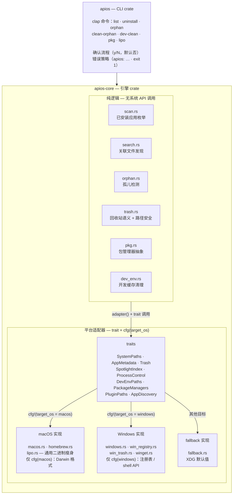

[English](../ARCHITECTURE.md) | [中文](ARCHITECTURE.zh-CN.md)

<!-- 翻译基准：badfec4（docs: Windows v0.2.0 — CI artifact, README/ARCHITECTURE/CHANGELOG, roadmap (M6)）。英文文档改动后请同步更新译文 -->

# 架构

ApiosCleaner 是一款围绕**可移植 Rust 核心**与**薄平台适配器层**构建的跨平台应用清理工具。所有匹配、扫描与孤儿检测逻辑都在核心内，不依赖任何系统 API；每个平台专属行为都在按 OS 实现的 trait 之后，编译期分发。

## Crate

| Crate | 职责 |
|---|---|
| `apios-core` | 引擎：文件发现、名称匹配、孤儿检测、回收站语义、包管理器抽象。跨平台（在 Linux/Windows 上零改动通过类型检查）；macOS 专属模块（通用二进制瘦身）在平台层内，由 `cfg(target_os)` 门控。 |
| `apios` | CLI。参数解析（clap）、确认流程、错误格式化（`apios: …` + exit 1）、结果报告。只依赖 `apios-core`。 |

## 平台适配器模式

每个与 OS 相关的行为都是 `apios-core/src/platform/` 下的一个 trait：

| Trait | 职责 | macOS 实现 | Windows 实现 | fallback 实现 |
|---|---|---|---|---|
| `SystemPaths` | home、缓存、临时目录、应用目录 | 真实路径 | `USERPROFILE` / `%APPDATA%` / `%LOCALAPPDATA%` 系 | XDG 默认值 |
| `AppMetadata` | entitlements、team identifier | codesign | `None`（元数据在注册表） | `None` |
| `Trash` | 回收站目录 + `move_to_trash` 动作 | `~/.Trash`、归档移动 | `SHFileOperationW`（`FO_DELETE` + `FOF_ALLOWUNDO` → Recycle Bin） | XDG 回收站目录 |
| `SpotlightIndex` | 补充文件查找 | `mdfind`（带超时） | 空 | 空 |
| `ProcessControl` | 终止运行中的应用 | `ps` + `kill -TERM`（按 bundle 前缀限定） | `tasklist` + `taskkill /F /T /IM` | 无操作 |
| `DevEnvPaths` | 开发环境缓存表 | macOS 表 | `%LOCALAPPDATA%`/`%APPDATA%` 表（13 个环境） | Linux XDG 表 |
| `PackageManagers` | 各包管理器的卸载/自动移除 | Homebrew | winget | 暂无 |
| `PluginPaths` | 插件类别表 | 18 个 macOS 类别 | 空 | 空 |
| `AppDiscovery` | 已安装应用枚举 | `.app` 遍历（scan.rs） | 注册表卸载项 + 开始菜单 `.lnk` | `.app` 遍历（scan.rs） |

`platform/mod.rs` 暴露 `pub type Adapter`（由 `cfg(target_os)` 选定：macOS 为 `macos::MacOsAdapter`、Windows 为 `windows::WindowsAdapter`、其他平台为 `fallback::FallbackAdapter`）以及全局访问器 `adapter()`。引擎代码调用 `crate::platform::adapter()` 并在作用域内引入 trait——逻辑本身从不按 OS 分支，因此新增平台只需新写 trait 实现，无需改动引擎。

macOS 实现进一步拆分：
- `platform/macos.rs` — 路径、Spotlight（`mdfind`）、进程控制（`ps`/`kill`）、`getconf`
- `platform/homebrew.rs` — brew CLI 包装（依赖检查、`--zap`、错误分诊）

Windows 实现全部为手写 FFI（零第三方依赖）：
- `platform/windows.rs` — `WindowsAdapter`（路径、发现、回收站、taskkill、开发环境表）
- `platform/win_registry.rs` — HKLM/HKCU 卸载项的 `Reg*W` 枚举（纯解析与 FFI 薄壳分离）
- `platform/win_trash.rs` — `SHFileOperationW` 回收站调用（批量 + 逐文件失败分类）
- `platform/winget.rs` — winget CLI 包装（所有包映射为 `Formula`；无 dependents/autoremove 概念）

## 引擎模块

| 模块 | 用途 |
|---|---|
| `scan.rs` | 枚举已安装应用（bundle identifier 读取、符号链接安全去重、`com.alienator88.Pearcleaner` 自身排除；macOS/fallback 的发现委托到这里） |
| `search.rs` | 查找应用的全部关联文件：带深度规则的目录遍历、供应商目录回退、名称匹配、离群项、最终集合去重 |
| `matcher.rs` / `conditions.rs` | 应跳过规则与按应用的特定条件（bundle id 精确匹配、包含/排除强制列表） |
| `orphan.rs` | 检测已卸载应用留下的文件（预建 UUID→bundle id 映射） |
| `identifiers.rs` | 缓存 bundle identifier 提取 + 名称归一化辅助 |
| `trash.rs` | 移入回收站的归档语义 + critical 表（关键路径）校验 + 撤销（恢复） |
| `pkg.rs` | 包管理器抽象与归类 |
| `dev_env.rs` | 开发环境缓存统计/清理 |
| `model.rs` | 核心类型：`AppInfo`、`Condition`、`Sensitivity`、`SkipCondition` |

## 安全模型

三层防护防止破坏性误操作：

1. **路径校验**（`trash.rs::validate_path`）：每条路径在与 critical 表（`/Applications`、`/Library`、`/System`、`/usr`、`/bin`、`/sbin`、`/etc`、`/var`、`/private`、`/opt`、`/Users`、`/Users/Shared`、home、`~/Applications`）匹配**之前**先做词法归一化（折叠 `..`、合并重复分隔符、去除尾部斜杠、拒绝相对路径）。这些根目录下的子路径（如 `~/Library/Preferences/…`）仍是合法删除目标。
   Windows 上归一化时**保留**盘符前缀（`C:\Windows` 若坍缩成 `/Windows` 会绕过 POSIX 表——已修复），critical 表由环境变量驱动：`SystemRoot`、`ProgramFiles`、`ProgramFiles(x86)`、`ProgramData`、用户配置根目录，外加拦截任何裸盘符根（`X:\`）的格式检测。
2. **可逆删除**：文件被*移动*进回收站内的时间戳归档目录（`<Name>_<yyyy-MM-dd_HH-mm-ss>`），绝不删除。`restore_files` 将其移回。Windows 上同一保证来自系统：带 `FOF_ALLOWUNDO` 的 `SHFileOperationW` 把文件送入 Recycle Bin（无归档目录，恢复由用户经系统 UI 完成）。
3. **确认机制**：每条删除命令先打印将执行的内容并询问 `y/N`（默认否）。`-y` 供脚本跳过提示；拒绝以 `Aborted — nothing was deleted.` 终止，exit 0。

## 测试策略

- **模块内单元测试**覆盖纯逻辑，用固定字节/字符串和 `tempfile` 临时目录树——无需真实系统状态。
- **Linux + Windows 交叉检查**（CI 中 `cargo check --target x86_64-unknown-linux-gnu` 与 `--target x86_64-pc-windows-gnu`）保证核心真正可移植：任何只在 macOS 上能编译的内容都被限制在适配器层。
- **Windows 原生 job** 在 `windows-latest` 上运行全量套件 + Windows 专属集成测试：创建、枚举并删除临时 HKCU 卸载键；经 `SHFileOperationW` 把临时文件移入 Recycle Bin；从固定输出解析 `winget list`。
- **macOS 实测回归**将输出与参考实现比对（测试应用上 9/9 与 17/17 文件集完全一致）。
